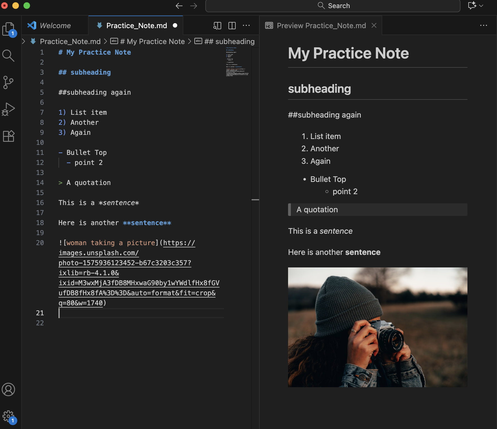

# Notes_12 Nov. 2025
## Analog versus Digital
1) Analog born: basic research. For example printing the article and annotating it. 
2) Digital born: identify and install computational needs like we did last week. Original or existing code, perhaps there is premade code designed for certain tasks like Python or are you actually going to write code. 
3) Some projects are a combination of both; collecting interviews and analysing the text with code. 

**cuPortfolio**: you can use git to create a static page. 

## What is a command line interface?
- We worked with command line tools and the interface is where you type in the commands.  
- Terminal is the command line we are using; command line interface. 
- Opening folders and word files; that is the graphical interface users in the computer.
- The command line: you can do all of these command lines just with typing instead of clicking. 
- In terminal: cd = change directory and then type which folder you want to go to. “cd Desktop” 
- Process:
  - In the folder 'Desktop'.
  - Type ‘ls’ and you get the list of folders.
  - To create a new folder: “mkdir” (meaning make directory) “mkdir” and type the folder you want to create. i.e. ‘mkdir ws_fall_2025’
  - If you are going deep in folders: ‘pwd’ (print working directory-prints where you are in your folder system).
  - I am on my desktop and I want to go back to my user folder: 'cd ..'
  - Type ‘clear’ for a fresh command; it erases your command. 
  
## Examples of Markup language:
Markup language: 
- i.e. html - all the text on the website.
- i.e. Extensible Markup Language (XML). 
- i.e. Markdown is the one we will use in this workshop. 
## Markdown
- Create a Markdown: cheat sheet website:  https://macodrum-c4dh-docs.netlify.app/toolkit/markdown/ 
- Open Visual Studio Code.
- ‘File’ ‘New Text File’
- Establish where to put this file; in the folder you have created. 
- Put a title: # My Practice Note
- Save it by clicking ‘File’ ‘Save as’ Ideally no spaces. 
- ‘Practice_Note.md’ (always ‘.md’)
- Then choose the file you want to put it in. 
- It will give you syntax highlighting. 

